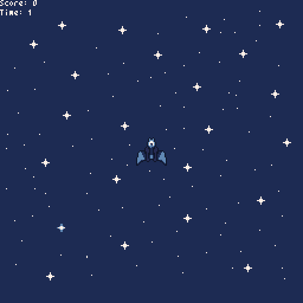

# pyxel-prelection

## Why Pyxel?

1. It's very simple to learn (for pros & newbies) (I've made a game in 4 hours! in pure python!)
2. Has many simple examples to copy&edit
3. Has a nice ascii font
4. 8bit sound generator is amazing
5. It's fast (using opengl)
6. Nice to learn programming in python

## Advantages

* Very simple API - you can learn it in one day
* Documentation is a 1 file (README file in github)
* sprites support
* basic shapes drawing support
* 8 bit music / sound
* tilemaps
* built in sprite / map / music editor (But I haven't used it)

## Limitations (by design or not)

* Documentation doesn't have examples directly
* Documentation doesn't describe arguments and what functions/methods do.
* Supports only 16 colors (image assets too!)
* Has a limited banks with sounds and images
* Doesn't have a collision system
* 256×256 screen size (with autoscalling so don't worry)
* No rotating / mirroring sprites
* No particles system
* Random bugs like segmentation fault or floating point error :-(

## Items

Assets: https://guardian5.itch.io/blue-green-and-red-spacecraft-asset (Thx!!)
Sound: Randomized
Engine: [Pyxel](https://github.com/kitao/pyxel)

## Stages

1. [init game](https://github.com/firemark/pyxel-prelection/commit/06d3eaa38ac4101876d1d2101f876350d708a908)
2. [change assets and draw sprites](https://github.com/firemark/pyxel-prelection/commit/e91f013ad0359f5b3d4fa6c6359ddc0d527678b8)
3. [add player object](https://github.com/firemark/pyxel-prelection/commit/1afc536cfd3a555cf7dd5f886178313f6ee3e748)
4. [add player moving](https://github.com/firemark/pyxel-prelection/commit/57157740be2d08240d176aa330579e254c669759)
5. [add rotating](https://github.com/firemark/pyxel-prelection/commit/66cdf9a9e3d558053eeb194b3b6245e975e10007)
6. [add bullets](https://github.com/firemark/pyxel-prelection/commit/9e1b7c6acd4dd89506ef87f73ea964d19f923ece)
7. [compute better cords of bullet](https://github.com/firemark/pyxel-prelection/commit/d6d2fdf903016e8b83d6478781f2797d97ae1227)
8. [add enemies](https://github.com/firemark/pyxel-prelection/commit/e2d92020e08e0507c2a97da2dac377020c95742a)
9. [add collision with enemy and bullets](https://github.com/firemark/pyxel-prelection/commit/092f89296ea5c455f7d81400c20f60408c7577e0)
10. [add spawning enemies](https://github.com/firemark/pyxel-prelection/commit/7d85309b3f5e9c1bfb96cdb52e0e5ab1847059b4)
11. [add music (OMG!)](https://github.com/firemark/pyxel-prelection/commit/09b24e559b5d32d32f5a0e64dfb9fd7a1e9e23d6)
12. [support game over](https://github.com/firemark/pyxel-prelection/commit/af9bf1c1d240c84e4e8484e2fc8f2b03e75f9eaf)
13. [add animations](https://github.com/firemark/pyxel-prelection/commit/ea3ab3390c624b4c8f63da9b81b5384a200250c7)
14. [add background](https://github.com/firemark/pyxel-prelection/commit/c60aa3cbd9052d1b19372d2839ad24ebc07d2a35)
15. [support gamepad](https://github.com/firemark/pyxel-prelection/commit/bb1886de23b846a418cd3b47a5033dedcc5c5a1a)
16. [improving gameplay](https://github.com/firemark/pyxel-prelection/commit/e943556e6d5114dbebe798d5a081ca5571abe05c)

## Conclusion

* It's not unreal or unity engine
* It's not game maker too (But is very similar to first versions of game maker)
* Is a lot of fun!
* In short time we can make a nice, simple game
* I love 8 bit so much <3
* A good way to learn python and programming

